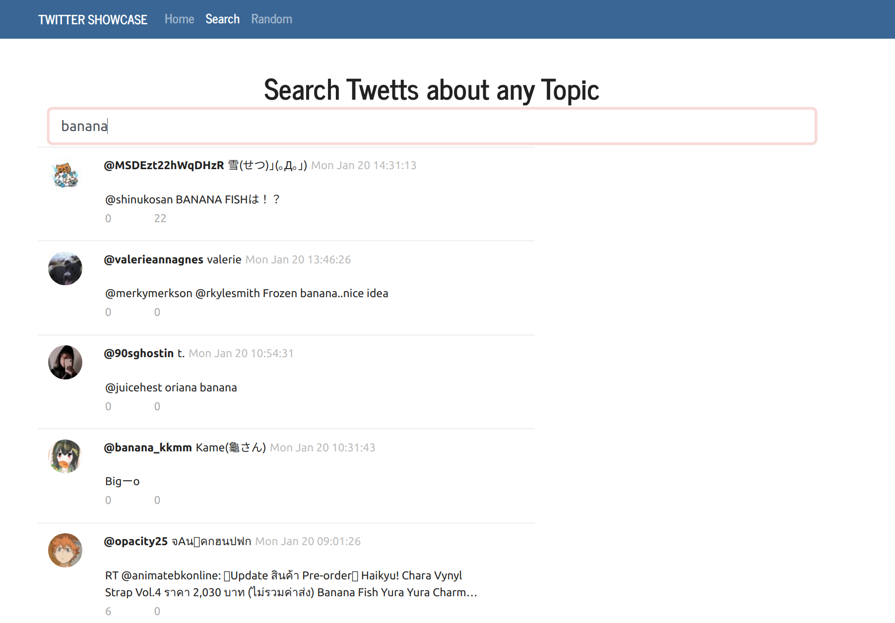

# Twitter Showcase App

_Search twetts about any topic._

View live on Heroku <a href="https://glacial-badlands-68918.herokuapp.com/" target="_blank">here</a>.

 

Twitter Showcase is an application that allows you to search twetts about any topic and give your random twetts by five users accounts. The main objective of this projects is to server as a learning tool and familiarize myselft with Node.js, Express.js at the backend and React.js on the frontend consuming Twitter API.

## Author

 -  **Maria Lobillo-Santos** - Full-Stack Software Developer <a href="https://marialobillo.github.io">Website</a> | <a href="https://www.linkedin.com/in/mar%C3%ADa-lobillo-santos/">LinkedIn</a>
